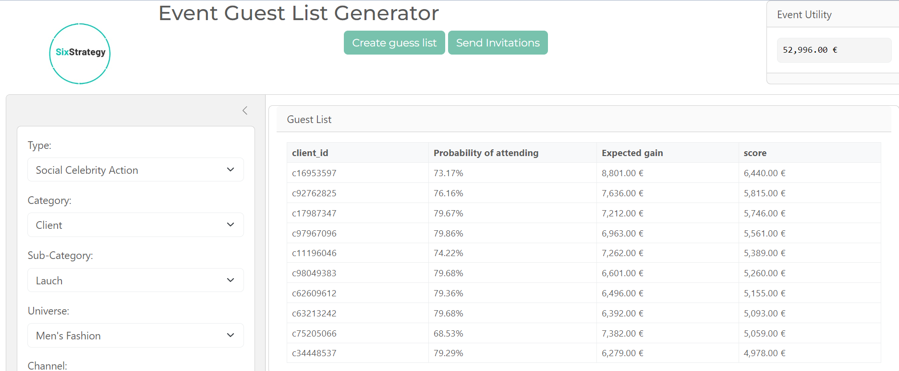

# InvitAItions: Smart Guest List Generator for Luxury Events

## Overview
An interactive dashboard application created for the Annual Essec Hacktahon 2024. The app optimizes guest lists for luxury events by predicting attendance probability and expected revenue. The tool uses machine learning models to suggest the most profitable guest combinations based on historical customer data and event characteristics.

## 🌟 Key Features
- **Event Configuration**
  - Customize event type and category
  - Set event duration and cost parameters
  - Choose from multiple channels and universes
  - Define event subcategories and labels

- **Smart Guest List Generation**
  - Automatic guest list creation based on ML predictions
  - Attendance probability calculation
  - Expected revenue forecasting
  - Optimized guest selection

- **Financial Analytics**
  - Real-time event utility calculation
  - Per-guest revenue prediction
  - Total event profitability analysis

## 🚀 Getting Started

### Prerequisites
- Python 3.8+
- Required Python packages:
    - markdown
    - shiny
    - pandas
    - numpy
    - scikit-learn


### Installation
1. Clone the repository
```bash
git clone 
```
2. Install dependencies

```bash
pip install -r requirements.txt
```

3. Run the application

```bash
shiny run src/app.py
```
4. Navigate to your local webserver: 

http://127.0.0.1:8000

## 📊 Data Structure
The application uses several data sources:

Client historical data

Transaction records

Event action data

Pre-event transaction data

## 🛠️ Models
The system employs two main machine learning models:

- Classifier Model : Predicts probability of attendance

- Regressor Model : Estimates expected revenue per guest

## 💻 Usage
- Launch the application

- Configure event parameters in the sidebar

- Click "Create guest list" to generate recommendations

- Review the suggested guest list and expected utility

- Use "Send Invitations" to proceed with the selected guests

## 📈 Dashboard Components
- Event configuration panel
- Guest list display with sorting capabilities
- Event utility calculator
- Interactive data grid for guest selection

## 🔍 Selection Criteria
- The guest list is generated based on:

- Historical purchase behavior

- Customer lifetime value

- Event-specific preferences

- Attendance probability

Expected revenue contribution

## 📱 Interface Preview




🤝 Contributing
Contributions are welcome! Please feel free to submit a Pull Request.


Built with Shiny
